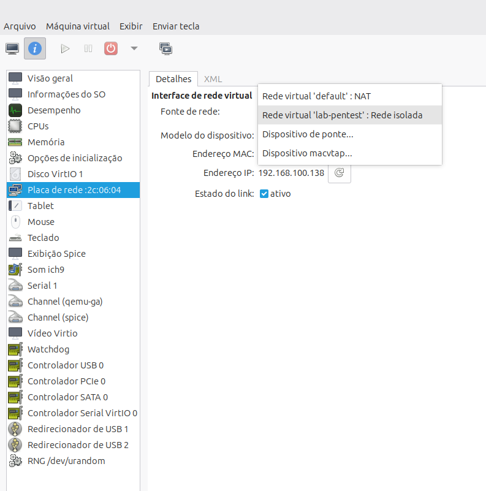

# Auditoria de Segurança: Ataques de Força Bruta com Medusa

## Objetivo
Este projeto documenta simulações práticas de ataques de força bruta contra serviços vulneráveis, utilizando o Kali Linux e a ferramenta Medusa, com foco na compreensão dos vetores de ataque e na proposição de medidas de mitigação.

## Fase 1: Preparação do Ambiente

Para este laboratório, o ambiente foi virtualizado utilizando o **virt-manager/KVM**, em vez da proposta inicial de utilizar o Virtualbox.
### Importação do Metasploitable 2

Como o Metasploitable 2 não é distribuído nativamente para o virt-manager, foi necessário converter o disco virtual original (VMDK) para o formato `.qcow2`. Para converter arquivos VMDK para QCOW2 no Linux, utiliza-se a ferramenta `qemu-img`, que é parte do pacote `qemu-utils`.

Sendo o Linux Mint um sistema baseado em Debian/Ubuntu, a instalação do pacote necessário é feita com o comando:

sudo apt-get install qemu-utils

(Nota: Em sistemas baseados em RHEL/Fedora, utiliza-se sudo yum install qemu-utils)
Após a instalação, a conversão foi executada com o seguinte comando:

qemu-img convert -p -f vmdk -O qcow2 arquivo_original.vmdk arquivo_convertido.qcow2

Parâmetros utilizados:

-p: Mostra o progresso da conversão.
-f vmdk: Indica que o formato de entrada é VMDK.
-O qcow2: Define o formato de saída como QCOW2.
arquivo_original.vmdk: Caminho para o arquivo VMDK de origem.
arquivo_convertido.qcow2: Nome do arquivo QCOW2 gerado.

### Configuração das Placas de Rede (Ambiente Isolado)

Para garantir que as máquinas se comuniquem apenas entre si, criando um ambiente controlado e seguro para os testes, a rede virtual foi configurada no **virt-manager** seguindo os passos abaixo:

1. No menu principal, acessou-se **Editar > Detalhes da Conexão**.
2. Na aba **Redes Virtuais**, uma nova rede foi criada (clicando no botão **+**).
3. **Parâmetros da nova rede:**
   * **Nome da rede:** `lab-pentest`
   * **Modo:** Isolado
   * **Configuração IPv4:** Habilitar IPv4
   * **Endereço da rede:** `192.168.100.0/24`
   * **DHCPv4:** Habilitado
   * **Range DHCP (Início - Fim):** `192.168.100.128` a `192.168.100.144`
4. Por fim, nas configurações de hardware de ambas as VMs (Kali Linux e Metasploitable 2), as interfaces de rede foram editadas para apontarem para a rede virtual recém-criada (`lab-pentest`).



## Fase 2: Planeamento e Criação de Wordlists

Para a execução dos ataques de força bruta, foi necessário criar dicionários (wordlists) contendo possíveis nomes de utilizadores e senhas. 

Num cenário de auditoria real, seriam utilizadas listas extensas. No entanto, para fins didáticos e para otimizar o tempo de execução neste ambiente controlado, foram criadas wordlists personalizadas e focadas, contendo credenciais padrão conhecidas de sistemas vulneráveis (como o `msfadmin` do Metasploitable) misturadas com senhas fracas comuns.

Os ficheiros foram criados no Kali Linux utilizando os seguintes comandos de terminal:

# Criação do diretório de trabalho
mkdir lab-medusa
cd lab-medusa

# Criação da wordlist de utilizadores
nano user.txt

### Conteúdo do ficheiro user.txt:

root
admin
user
msfadmin
test

# Criação da wordlist de senhas
nano password.txt

### Conteúdo do ficheiro password.txt:
```text
123456
123456
password
admin
root
msfadmin

123456
password
admin
root
msfadmin


