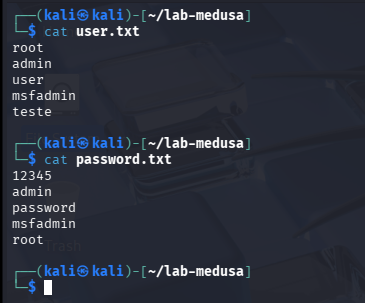
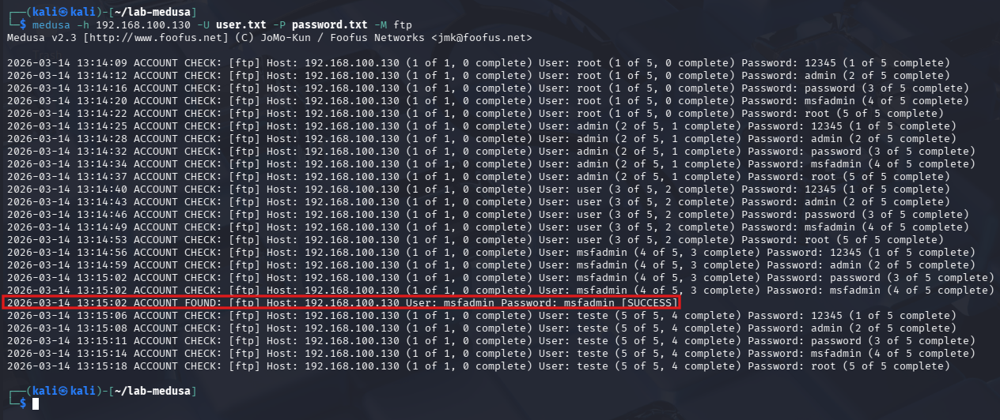
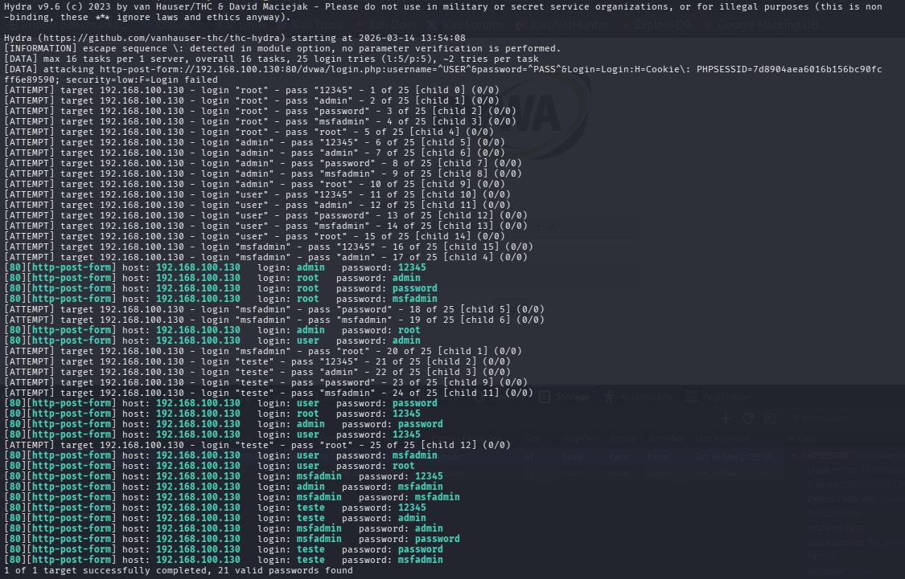
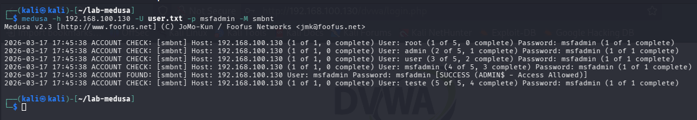

# Auditoria de Segurança: Simulação de Ataques de Força Bruta

## Objetivo
Este projeto documenta simulações práticas de ataques de força bruta contra serviços vulneráveis (como FTP, Web e SMB). Utilizando o sistema Kali Linux e ferramentas especializadas em testes de intrusão, o laboratório tem como foco a compreensão dos vetores de ataque, a adaptação frente a limitações de software e a proposição de medidas de mitigação eficazes.

## Fase 1: Preparação do Ambiente

Para este laboratório, o ambiente foi virtualizado utilizando o **virt-manager/KVM**, em vez da proposta inicial de utilizar o Virtualbox.

### Importação do Metasploitable 2

Como o Metasploitable 2 não é distribuído nativamente para o virt-manager, foi necessário converter o disco virtual original (VMDK) para o formato `.qcow2`. Para converter arquivos VMDK para QCOW2 no Linux, utiliza-se a ferramenta `qemu-img`, que é parte do pacote `qemu-utils`.

Sendo o Linux Mint um sistema baseado em Debian/Ubuntu, a instalação do pacote necessário é feita com o comando:
```text
sudo apt-get install qemu-utils
```
(Nota: Em sistemas baseados em RHEL/Fedora, utiliza-se sudo yum install qemu-utils)
Após a instalação, a conversão foi executada com o seguinte comando:

qemu-img convert -p -f vmdk -O qcow2 arquivo_original.vmdk arquivo_convertido.qcow2

Parâmetros utilizados:

-p: Mostra o progresso da conversão.
-f vmdk: Indica que o formato de entrada é VMDK.
-O qcow2: Define o formato de saída como QCOW2.
arquivo_original.vmdk: Caminho para o arquivo VMDK de origem.
arquivo_convertido.qcow2: Nome do arquivo QCOW2 gerado.

### Configuração das Placas de Rede (Ambiente Isolado)

Para garantir que as máquinas se comuniquem apenas entre si, criando um ambiente controlado e seguro para os testes, a rede virtual foi configurada no **virt-manager** seguindo os passos abaixo:

1. No menu principal, acessou-se **Editar > Detalhes da Conexão**.
2. Na aba **Redes Virtuais**, uma nova rede foi criada (clicando no botão **+**).
3. **Parâmetros da nova rede:**
   * **Nome da rede:** `lab-pentest`
   * **Modo:** Isolado
   * **Configuração IPv4:** Habilitar IPv4
   * **Endereço da rede:** `192.168.100.0/24`
   * **DHCPv4:** Habilitado
   * **Range DHCP (Início - Fim):** `192.168.100.128` a `192.168.100.144`
4. Por fim, nas configurações de hardware de ambas as VMs (Kali Linux e Metasploitable 2), as interfaces de rede foram editadas para apontarem para a rede virtual recém-criada (`lab-pentest`).


## Fase 2: Planeamento e Criação de Wordlists

Para a execução dos ataques de força bruta, foi necessário criar dicionários (wordlists) contendo possíveis nomes de utilizadores e senhas. 

Num cenário de auditoria real, seriam utilizadas listas extensas. No entanto, para fins didáticos e para otimizar o tempo de execução neste ambiente controlado, foram criadas wordlists personalizadas e focadas, contendo credenciais padrão conhecidas de sistemas vulneráveis (como o `msfadmin` do Metasploitable) misturadas com senhas fracas comuns.

Os ficheiros foram criados no Kali Linux utilizando os seguintes comandos de terminal:

# Criação do diretório de trabalho
```text
mkdir lab-medusa
cd lab-medusa
```
# Criação da wordlist de usuários
```text
nano user.txt
```
### Conteúdo do ficheiro user.txt:
```text
root
admin
user
msfadmin
test
```
# Criação da wordlist de senhas
```text
nano password.txt
```
### Conteúdo do ficheiro password.txt:
```text
123456
123456
password
admin
root
msfadmin
```



## Fase 3: Execução dos Ataques com Medusa

O Medusa é uma ferramenta modular e célere para ataques de força bruta em paralelo. Nesta fase, foram explorados diferentes serviços do ambiente vulnerável.

### 3.1. Ataque de Força Bruta ao Serviço FTP

O primeiro vetor de ataque foi o serviço FTP (File Transfer Protocol). Utilizando as wordlists criadas na fase anterior, o ataque foi lançado contra o Metasploitable 2.

**Comando executado:**

```bash
medusa -h 192.168.100.x -U user.txt -P password.txt -M ftp
```
Descrição dos parâmetros:

-h: Especifica o host (endereço IP do alvo).
-U: Indica o ficheiro com a lista de utilizadores.
-P: Indica o ficheiro com a lista de palavras-passe.
-M ftp: Define o módulo a ser utilizado pelo Medusa.

Evidência de Sucesso:
A ferramenta iterou sobre os dicionários até encontrar as credenciais válidas, assinalando o sucesso (SUCCESS) na saída do terminal, conforme ilustrado abaixo:



### 3.2. Ataque a Formulário Web (DVWA) e Adaptação de Ferramenta

O segundo vetor de ataque focou-se num formulário web utilizando a aplicação Damn Vulnerable Web App (DVWA), que vem embutida no Metasploitable 2.

**Desafio Encontrado com o Medusa:**
A tentativa inicial de utilizar o módulo `web-form` do Medusa resultou num erro `302 (Redirect)`.

```bash
# Comando inicial (que resultou em erro 302)
medusa -h 192.168.100.130 -U user.txt -P password.txt -M web-form -m FORM:"/dvwa/login.php" -m FORM-DATA:"post?username=&password=&Login=Login" -m DENY-SIGNAL:"Login failed"
```
O DVWA redireciona a página em vez de devolver um erro estático de imediato. Como o módulo web do Medusa é antigo, ele aborta a tentativa ao deparar-se com um código 302, mesmo após a injeção do cookie de sessão (PHPSESSID).

A Adaptação: Pivotando para o Hydra
Uma competência essencial numa auditoria de segurança é a capacidade de adaptação. Face à limitação do Medusa com redirecionamentos HTTP, a estratégia foi ajustada para utilizar o THC Hydra, uma ferramenta padrão da indústria, mais robusta para lidar com aplicações web modernas.

Para o ataque ser bem-sucedido, foi necessário extrair previamente o cookie de sessão (PHPSESSID) do navegador.

Comando executado com o Hydra:
```text
hydra -L user.txt -P password.txt 192.168.100.130 http-post-form "/dvwa/login.php:username=^USER^&password=^PASS^&Login=Login:H=Cookie\: PHPSESSID=7d8904aea6016b156bc90fcff6e89590; security=low:F=Login failed" -V
```
Descrição dos parâmetros:

-L e -P: Define os ficheiros com as listas de utilizadores e senhas.
http-post-form: O módulo que lida com formulários e redirecionamentos.
H=Cookie\:: Injeta o cookie de sessão válido.
F=Login failed: Indica a string de falha.
-V: Modo Verbose para visualizar as tentativas.

Abaixo encontra-se a evidência da execução do Hydra, demonstrando a interação com o servidor e as tentativas de login:


### 3.3. Password Spraying no Serviço SMB

Diferente de um ataque de força bruta tradicional, a técnica de *Password Spraying* (Pulverização de Senhas) consiste em testar uma única senha comum contra múltiplos usuários. Esta abordagem é frequentemente utilizada por atacantes em ambientes corporativos para evitar o acionamento de políticas de bloqueio de conta (*Account Lockout*).

Neste vetor, o alvo foi o serviço SMB (Server Message Block), utilizando a senha `msfadmin` contra a lista de usuários criada na Fase 2.

**Comando executado:**
```bash
medusa -h 192.168.100.130 -U user.txt -p msfadmin -M smbnt
```
Descrição dos parâmetros:

-U: Indica o arquivo com a lista de usuários a serem testados.

-p: Define uma única senha, em texto claro, para ser testada contra todos os usuários do dicionário.

-M smbnt: Define o módulo da ferramenta para o protocolo SMB.

Evidência de Sucesso:
A ferramenta iterou a senha fornecida através da lista de usuários, identificando o acesso válido para a conta msfadmin, conforme a saída do terminal:


## Fase 5: Medidas de Mitigação

A exploração bem-sucedida dos serviços FTP, Web e SMB evidencia a criticidade de políticas de controle de acesso rigorosas. Para mitigar os riscos associados a ataques de Força Bruta e *Password Spraying*, recomendam-se as seguintes ações defensivas:

* **Implementação de Políticas de Senhas Fortes:** Exigir senhas longas (entre 12 e 16 caracteres) e complexas, além de proibir o uso de senhas comuns ou que contenham dados pessoais do utilizador.
* **Bloqueio de Conta (Account Lockout) e Rate Limiting:** Configurar o bloqueio automático da conta após um número específico de tentativas falhas consecutivas (ex: 5 tentativas). Para serviços web, implementar *Rate Limiting* (limite de requisições por IP) e o uso de CAPTCHAs em formulários de autenticação.
* **Autenticação Multifator (MFA):** Exigir um segundo fator de autenticação (como um token de aplicativo ou SMS) para o acesso a serviços críticos, neutralizando o ataque mesmo que a senha seja comprometida.
* **Desativação de Serviços e Protocolos Inseguros:** Substituir protocolos que transmitem dados em texto claro (como FTP ou Telnet) por alternativas seguras com criptografia (como SFTP ou SSH).
* **Monitorização e Alertas de Logins Anômalos:** Implementar soluções de SIEM (Security Information and Event Management) para detetar padrões anómalos, como tentativas de login no mesmo utilizador a partir de vários IPs (Força Bruta) ou uma única tentativa de login em dezenas de utilizadores simultaneamente a partir da mesma origem (*Password Spraying*).
* **Restrição de Acesso à Rede:** Limitar o acesso a serviços internos (como o SMB) utilizando Firewalls e VPNs, garantindo que não fiquem expostos diretamente à internet.

---

## Conclusão
Este laboratório prático evidenciou a eficácia de ataques de dicionário e pulverização de senhas contra serviços mal configurados. A experiência também destacou a importância da adaptação técnica do auditor de segurança face a limitações de ferramentas e comportamentos de aplicações web modernas (como os redirecionamentos HTTP 302). A implementação de uma arquitetura de defesa em profundidade, aliada ao monitoramento contínuo, é essencial para proteger os ativos organizacionais contra este tipo de ameaça.
